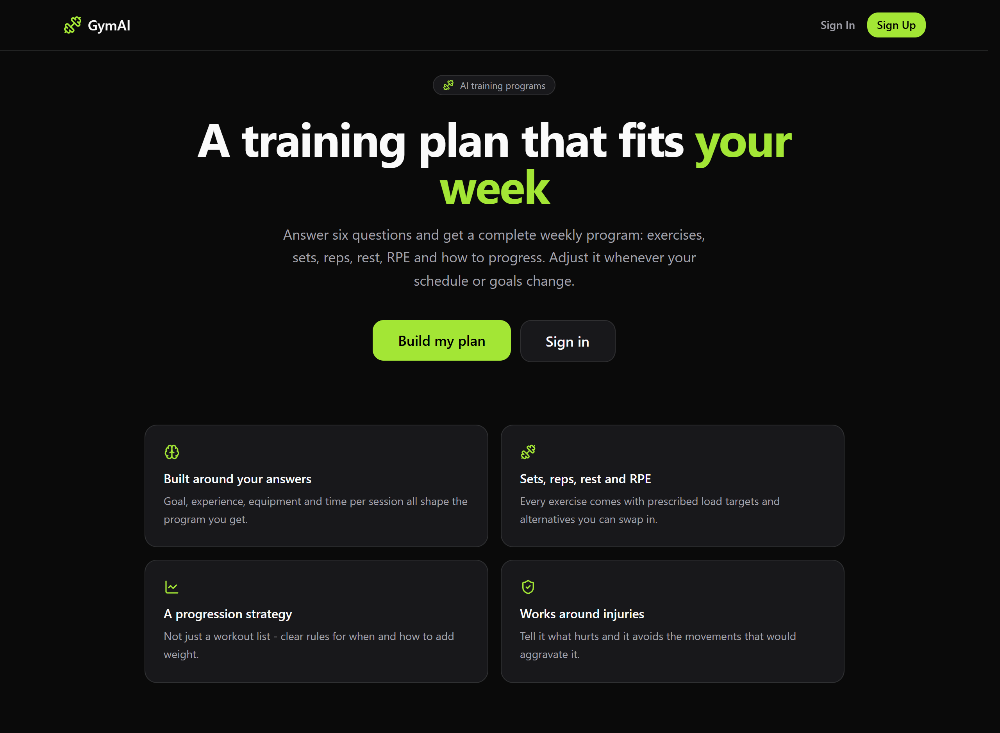
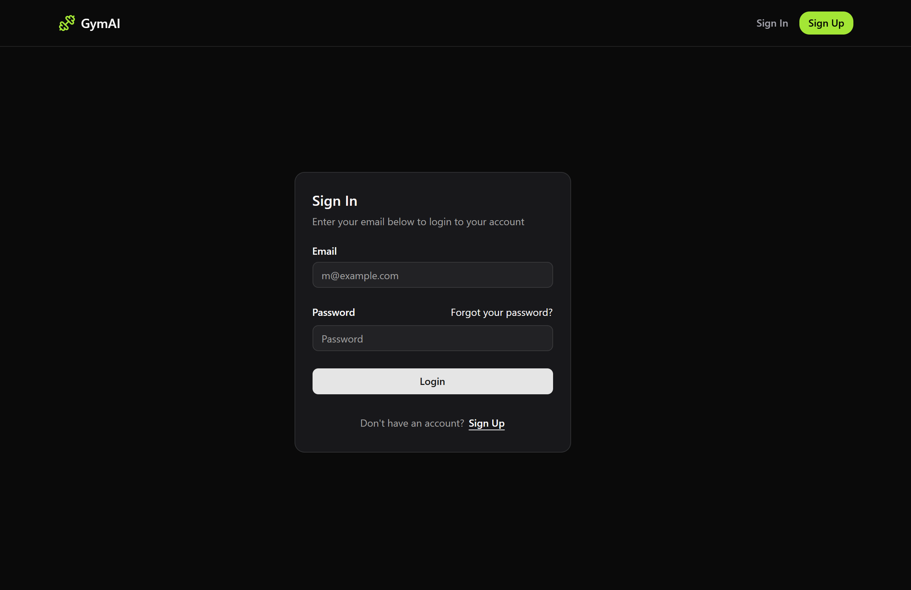
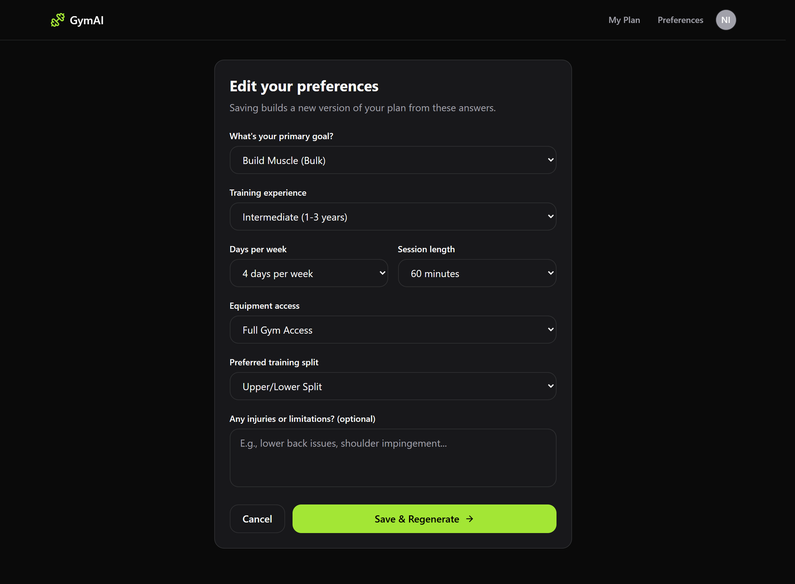
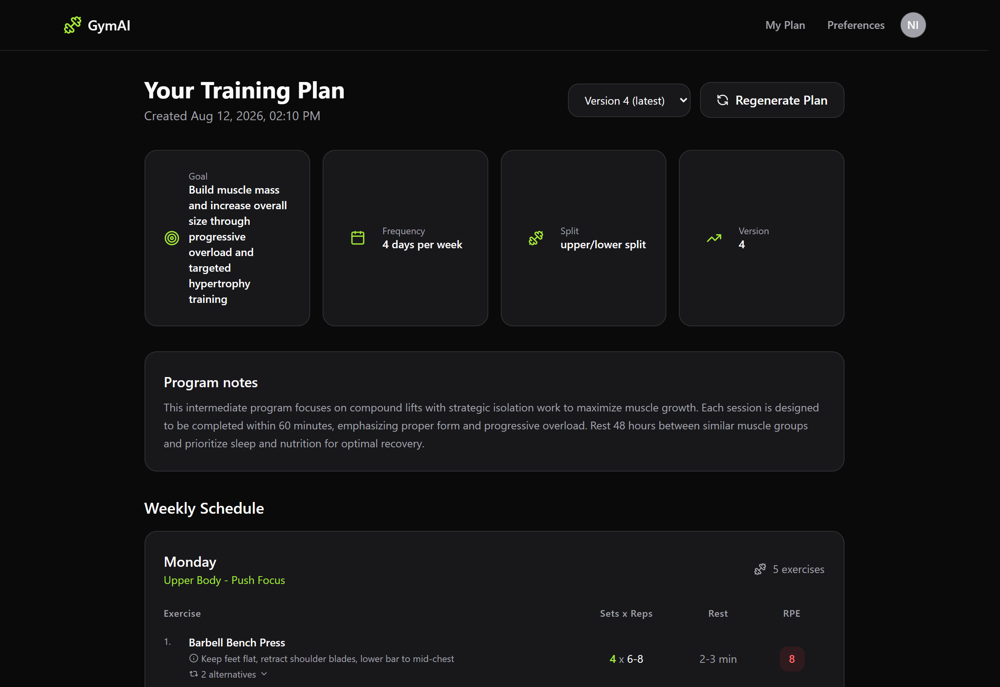
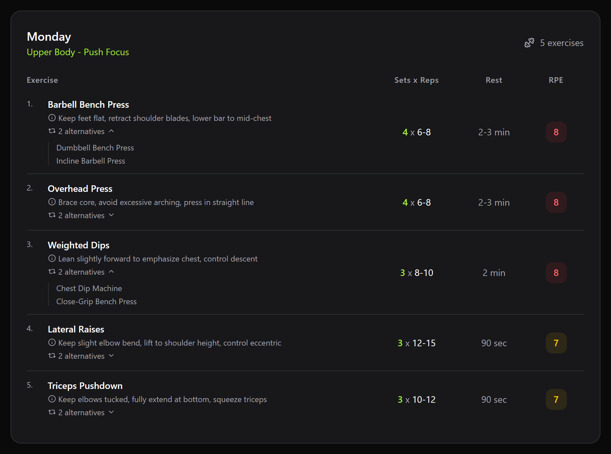
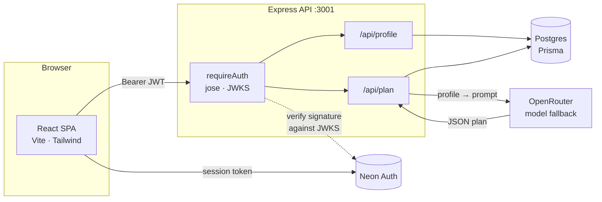
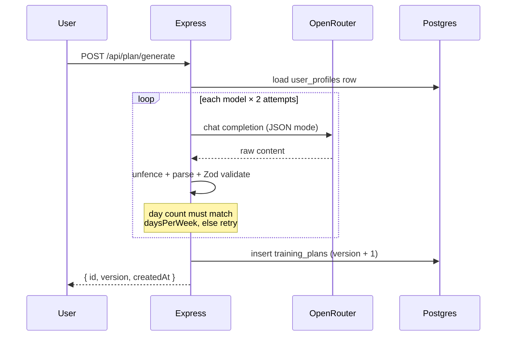
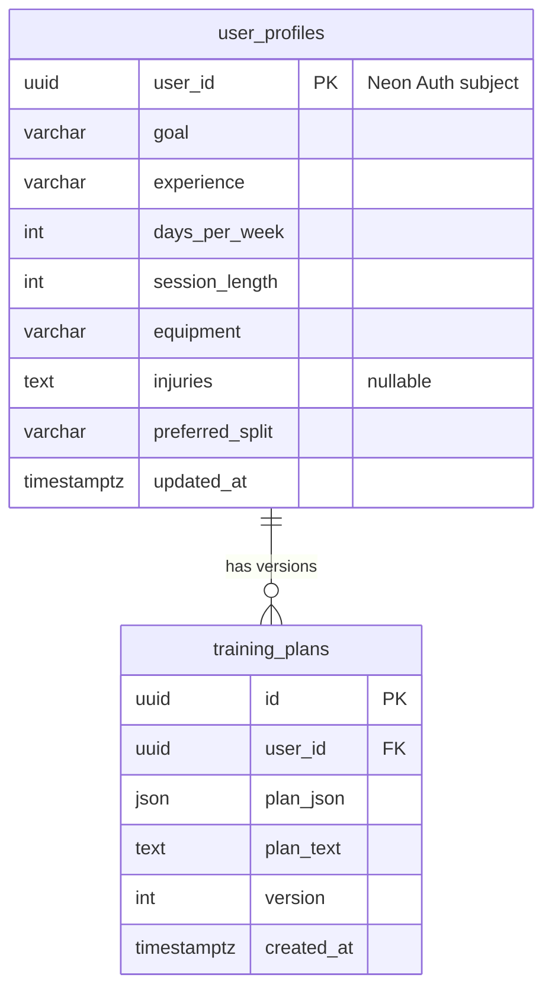

<div align="center">

# 🏋️ GymAI

**A training plan that fits your week.**

Answer six questions and get a complete weekly program — exercises, sets, reps, rest, RPE
and a progression strategy. Regenerate it whenever your schedule, equipment or goals change.

[](https://react.dev)
[](https://www.typescriptlang.org)
[](https://vite.dev)
[](https://tailwindcss.com)
[](https://expressjs.com)
[](https://www.prisma.io)
[](https://neon.tech)
[](#-testing)

</div>

---

## 📸 Screenshots

<div align="center">



<sub>**The landing page** — dark, single accent, no marketing fluff.</sub>

<br />

|                   🔐 Sign in                   |                  📝 Questionnaire                   |
| :--------------------------------------------: | :-------------------------------------------------: |
|        |    |
|      Email + password, handled by Neon Auth    |     Six answers are all the generator needs         |

|                  📋 Your plan                  |              🔍 A workout day, expanded             |
| :--------------------------------------------: | :-------------------------------------------------: |
|     |        |
|   Overview, program notes and the week ahead   |  Form cues, swap-in alternatives, RPE colour-coded  |

</div>

---

## ✨ Features

| | |
| :-- | :-- |
| 🧠 **Built around your answers** | Goal, experience, equipment, days per week and session length all feed the prompt, so no two programs look alike. |
| 🏋️ **Sets, reps, rest and RPE** | Every exercise carries prescribed load targets, form cues, and swap-in alternatives you can expand inline. |
| 📈 **A progression strategy** | Not just a workout list — explicit rules for when and how to add weight. |
| 🛡️ **Works around injuries** | Describe what hurts and the generator avoids movements that would aggravate it. |
| 🗂️ **Versioned plans** | Every regeneration is stored as a new version. Switch back through the history at any time. |
| 🔐 **Real authentication** | Neon Auth issues the session; the API verifies every request against the project JWKS and scopes all queries to the token's subject. |
| ✅ **Validated end to end** | Zod guards the request body *and* the model's output, so nothing malformed reaches the database or the UI. |
| ⚡ **Lean first paint** | Routes, the auth UI and the user menu are code-split, keeping the signed-out landing page off the auth bundle. |

---

## 🧱 Tech stack

| Layer        | Choice                                                                 |
| ------------ | ---------------------------------------------------------------------- |
| **Frontend** | React 19 · TypeScript · Vite 8 · Tailwind CSS 4 · React Router 7 · lucide-react |
| **Backend**  | Node · Express 5 · TypeScript · Zod 4 · express-rate-limit             |
| **Database** | Postgres (Neon) via Prisma 7 with the `@prisma/adapter-pg` driver adapter |
| **Auth**     | Neon Auth (`@neondatabase/neon-js`) — JWT verified server-side with `jose` |
| **AI**       | OpenRouter through the OpenAI SDK, with model fallback and retries      |
| **Tests**    | Vitest                                                                 |

---

## 🏗️ Architecture



The client never sends a user id. The API derives it from the verified token's `sub`
claim and scopes every Prisma query to it, so a plan id belonging to another account
comes back as a plain `404`.

### How a plan gets generated



Models ignore "JSON only" often enough that the response is unfenced before parsing,
missing fields are backfilled with sensible defaults, and a structurally valid plan with
the wrong number of days is kept as a fallback rather than failing the request outright.

---

## 🚀 Getting started

### Prerequisites

- **Node.js `^20.19` or `>=22.12`** (Vite 8's requirement; developed on Node 24)
- A **Postgres** database — a [Neon](https://neon.tech) project gives you the database and auth in one place
- An **[OpenRouter](https://openrouter.ai)** API key (the default models are free tier)

### 1. Install

```bash
npm install && npm --prefix server install
```

> The web app and the API are separate packages with separate `node_modules`.

### 2. Configure the environment

Two env files, one per process. Copy the examples and fill them in:

```bash
cp .env.example .env && cp server/.env.example server/.env
```

**`.env` — the web app** (everything here ships to the browser, so no secrets):

| Variable             | Required | Description                                                    |
| -------------------- | :------: | -------------------------------------------------------------- |
| `VITE_API_URL`       |    ➖    | Base URL of the API. Defaults to `http://localhost:3001`.        |
| `VITE_NEON_AUTH_URL` |    ✅    | Neon Auth base URL. Must match `NEON_AUTH_URL` on the server.    |

**`server/.env` — the API:**

| Variable            | Required | Description                                                                    |
| ------------------- | :------: | ------------------------------------------------------------------------------ |
| `DATABASE_URL`      |    ✅    | Postgres connection string.                                                     |
| `OPEN_ROUTER_KEY`   |    ✅    | OpenRouter API key used for plan generation.                                    |
| `NEON_AUTH_URL`     |    ✅    | Tokens are verified against `<NEON_AUTH_URL>/.well-known/jwks.json`.            |
| `PORT`              |    ➖    | Defaults to `3001`.                                                             |
| `BASE_URL`          |    ➖    | Sent to OpenRouter as the referer. Defaults to `http://localhost:3001`.         |
| `CORS_ORIGINS`      |    ➖    | Comma-separated allowed origins. Defaults to `http://localhost:5173`.           |
| `NEON_AUTH_ISSUER`  |    ➖    | Set to the token's `iss`/`aud` claim to tighten verification.                    |
| `AI_MODELS`         |    ➖    | Comma-separated OpenRouter models, tried in order. Free models come and go — this is the escape hatch. |

> The server validates its environment with Zod on boot and exits with a readable list of
> problems rather than failing later on the first request.

### 3. Set up the database

The generated Prisma client is not committed, so generate it and apply the migrations.
Both commands read `prisma.config.ts`, so run them **from `server/`**:

```bash
cd server && npx prisma generate && npx prisma migrate deploy
```

### 4. Run it

Two terminals:

```bash
npm --prefix server run dev:server
```

```bash
npm run dev
```

The app is on **http://localhost:5173**, the API on **http://localhost:3001**.

---

## 📡 API reference

Every route below requires an `Authorization: Bearer <token>` header. The user is taken
from the token, never from the request.

| Method | Endpoint             | Description                                                     |
| ------ | -------------------- | --------------------------------------------------------------- |
| `GET`  | `/api/health`        | Liveness check. The only unauthenticated route.                  |
| `GET`  | `/api/profile`       | The signed-in user's questionnaire answers. `404` if not set up. |
| `POST` | `/api/profile`       | Create or update the profile (upsert).                           |
| `POST` | `/api/plan/generate` | Generate a plan from the stored profile. **Rate limited to 10/hour per user.** |
| `GET`  | `/api/plan/current`  | The newest plan. `404` if none exists yet.                       |
| `GET`  | `/api/plan/history`  | All versions, newest first — id, version and timestamp.          |
| `GET`  | `/api/plan/:id`      | One specific version, scoped to the caller.                      |

Errors always come back as JSON — `{ "error": string, "details"?: unknown }` — including
validation failures, which list the offending fields.

---

## 🗄️ Data model



Deleting a profile cascades to its plans.

---

## 📂 Project structure

```
gym-planner/
├── src/                        # React app
│   ├── components/
│   │   ├── layout/             # Navbar, ProtectedRoute, auth UI boundary
│   │   ├── plan/               # PlanDisplay — the weekly schedule tables
│   │   └── ui/                 # Button, Card, Input, Select, Skeleton, ...
│   ├── context/                # Auth session + user data, toasts
│   ├── lib/                    # API client, Neon Auth client
│   ├── pages/                  # Home, Auth, Onboarding, Profile, Account, NotFound
│   └── types/
└── server/                     # Express API
    ├── lib/                    # env validation, Prisma client, model JSON parsing
    ├── middleware/             # requireAuth, error handler
    ├── prisma/                 # schema + migrations
    ├── routes/                 # profile, plan
    ├── schemas/                # Zod contracts for input and model output
    ├── src/lib/ai.ts           # prompt building, model fallback, retries
    └── tests/
```

---

## 🧪 Testing

```bash
npm --prefix server test
```

**44 tests** across three suites:

- `requireAuth.test.ts` — signature, expiry and claim checking against a locally generated key pair (only the key source is faked, `jwtVerify` stays real)
- `schemas.test.ts` — the profile and training-plan contracts, including the rejections
- `parseModelJson.test.ts` — fenced, padded and prose-wrapped model responses

Watch mode: `npm --prefix server run test:watch`.

---

## 📜 Scripts

| Command                              | What it does                                  |
| ------------------------------------ | --------------------------------------------- |
| `npm run dev`                        | Vite dev server with HMR                      |
| `npm run build`                      | Type-check and build the production bundle    |
| `npm run preview`                    | Serve the built bundle locally                |
| `npm run lint`                       | ESLint over the whole project                 |
| `npm --prefix server run dev:server` | API in watch mode (`tsx watch`)               |
| `npm --prefix server test`           | Run the Vitest suite once                     |
